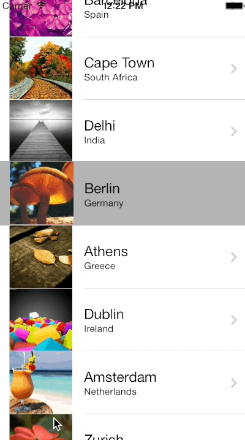

RSTransitionEffect
==================

Re-implement mayuur's MJTransitionEffect(https://github.com/mayuur/MJTransitionEffect) and provide default data binding for UITableViewCell and detail view controller and solve the white screen problem. All images, data source are taken from mayuur's MJTransitionEffect.

My implementation introduces source frames and target frames for RSTransitionEffectViewController, provide basic data item and data item -> view binding and frame calucations.

1. RSBasicItem, data item for UITableViewCell, contains text, detailText, image.
2. UITableView category, provides cell itself, textLabel, detailTextLabel, imageView frames' conversion to absolute screen coordinate.
3. RSTransitionEffectViewController, provides data binding, animations, etc.

In the sample it demonstrates the relationship and usage between list -> item -> detail.

In storyboard, create a detail view controller which subclassing RSTransitionEffectViewController, and link predefined IBOutlet to current views then in UITableViewDelegate, instantiate the view controller defined in storyboard and pass sourceFrames and current list item to it:

    - (void)tableView:(UITableView *)tableView didSelectRowAtIndexPath:(NSIndexPath *)indexPath
    {
        [tableView deselectRowAtIndexPath:indexPath animated:NO];
    
        RSDetailViewController *viewController = [self.storyboard instantiateViewControllerWithIdentifier:@"detail"];
        viewController.sourceFrames = [tableView framesForRowAtIndexPath:indexPath];
        viewController.item = [self.items objectAtIndex:[indexPath row]];
        [self.navigationController pushViewController:viewController animated:NO];
    }

and that's all, the new detail view controller will display with beautiful transition effect.

